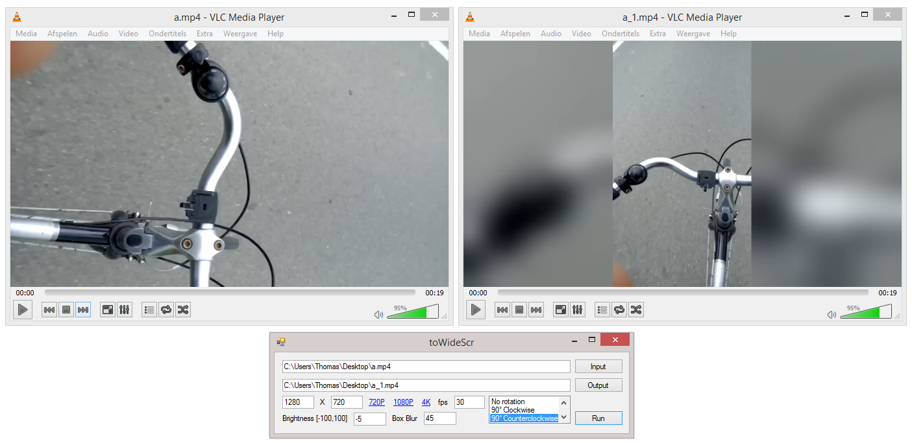

# toWideScr
A simple program to convert rotated smartphone video's to widescreen.

https://www.ffmpeg.org/ The program is based on the ffmpeg comandline tool. 

### On linux:
- Install Mono: https://www.mono-project.com/
- Install FFmpeg: https://www.ffmpeg.org/

```shell
$ mono ./toWideScr/bin/Release/toWideScr.exe 
```

### Screenshot(s)


